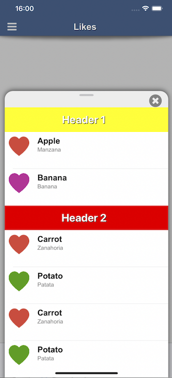

# Titanium BottomSheetController iOS Module
iOS 15+ and fallback version for older iOS - UISheetPresentationController

## UPDATE for 1.2.0
added customDetents (iOS16)

## UPDATE for 1.0.7
now MacCatalyst (15+) compatible

## UPDATE for 1.0.5 and 1.0.6
events and methods are changed!
Also new features for the nonSystemSheet!




## Methods

* MODULE  -> `createBottomSheet({properties}) `<br/> the **bottomSheetObject**

## bottomSheetObject Methods
* `open({animated:bool}) `
* `close({animated:bool}) `<br/> close the controller, per exaple if to did any action in the content view
* `selectedDetentIdentifier`<br/>return STRING - selectedDetentIdentifier (medium,large or none)
* `changeCurrentDetent(STRING)`<br/>change the selectedDetentIdentifier animated ('large' or 'medium') **on 'nonSystemSheet:false' only** (iOS15+)


## Events

* `open `
* `close `
* `dismissing `
* `detentChange ` returns {"selectedDetentIdentifier":"medium",....}


## Properties

* `width:INTEGER`<br/>the width of the sheet can now be set (DIP only and for nonSystemSheet only)

* `detents:{large:bool,medium:bool,small:bool}`<br/>The object of heights where a sheet can rest.
 *if not set, default to 'medium' only*

* `customDetents:{key:value,key:value....}`<br/>The object of key/value pairs ex: 'customA':100  where a sheet can rest. Multiple pairs possible
 

* `preferredCornerRadius:integer`<br/>The corner radius that the sheet attempts to present with.
 *if not set default to iOS default radius*

*	`prefersEdgeAttachedInCompactHeight:bool` <br/>A Boolean value that determines whether the sheet attaches to the bottom edge of the screen in a compact-height size class.

* `prefersScrollingExpandsWhenScrolledToEdge:bool`<br/>A Boolean value that determines whether scrolling expands the sheet to a larger detent.

* `widthFollowsPreferredContentSizeWhenEdgeAttached:bool`<br/>A Boolean value that determines whether the sheet's width matches its view controller's preferred content size.

* `prefersGrabberVisible:bool`<br/>A Boolean value that determines whether the sheet shows a grabber at the top.

* `nonModal:bool`<br/>has effect ONLY when "nonSystemSheet:false" on iOS >= 15

* `startDetent:string`<br/>medium or large or the a key from customDetents - if not set, it is full dimmed depending on activated detents - The largest detent that doesn’t dim the view underneath the sheet.


* `largestUndimmedDetentIdentifier:string`<br/>medium or large - if not set, it is full dimmed depending on activated detents - The largest detent that doesn’t dim the view underneath the sheet.
 ***If not set, defaults to full dimmed***

* `contentView:TiUIView,TiUIWindow or TiUINavigationWindow`<br/>View (any kind), Window or NavigationWindow

* `closeButton:TiUIView`<br/>View or Button

* `backgroundColor:Hex or String`

* `nonSystemSheet:bool`<br/>A Boolean value that determines whether the sheet is iOS15 or fallback version - if "false" and device is non iOS15 it also fallbacks
 **if NOT SET -> defaults to "true"**

* `nonSystemSheetTopShadow:bool`<br/>topShadow visible or not visible

* `nonSystemSheetShouldScroll:bool`<br/>when your contentView is not a scrollable view, then this activates scrolling if the contentView is larger then the bottomSheet
 **ATTENTION**: when you put a tableView, scrollView inside your contentView this property disables scrolling in the contentView in favour of the bottomSheetScrollView


* `nonSystemSheetAutomaticStartPositionFromContentViewHeight:bool`<br/>when this property is "**true**" the nonSystemSheet opens in the height of the contentView, **all detents are disabled**, only the real height is active, "**startDetent**" property **will be ignored**, also the "detents" property are ignored -- if you want an undimmed background, then you need to set property "**largestUndimmedDetentIdentifier**" to "large" if NOT set defaults to false

* `nonSystemSheetSmallHeight:integer`<br/>(optional) when set, the small detent is set to this height

* `nonSystemSheetMediumHeight:integer`<br/>(optional) when set, the medium detent is set to this height

* `nonSystemSheetLargeHeight:integer`<br/>(optional) when set, the large detent is set to this height

* `nonSystemSheetHandleColor:Hex or String`<br/>(optional) when set, the handle will be in that color

* `nonSystemSheetDisableDimmedBackground:bool`<br/>(optional) when set true, disables the dimmed backgroundView of the sheetcontroller

* `nonSystemSheetDisableDimmedBackgroundTouchDismiss:bool`<br/>(optional) when set true, disables the touch event on the dimmed backgroundView that will close the sheetController

* `nonSystemSheetDisablePanGestureDismiss:bool`<br/>(optional) when set true, disables the pan gesture (drag down to close), closing is only possible via closeButton then OR via "close" method

## Example

```js
var TiBottomSheetControllerModule = require("ti.bottomsheetcontroller");
var tableRows = [];

var tableData = [ {title: 'Apples'}, {title: 'Bananas'}, {title: 'Carrots'}, {title: 'Potatoes'},{title: 'Apples'}, {title: 'Bananas'}, {title: 'Carrots'}, {title: 'Potatoes'},{title: 'Apples'}, {title: 'Bananas'}, {title: 'Carrots'}, {title: 'Potatoes'},{title: 'Apples'}, {title: 'Bananas'}, {title: 'Carrots'}, {title: 'Potatoes'},{title: 'Apples'}, {title: 'Bananas'}, {title: 'Carrots'}, {title: 'Potatoes'},{title: 'Apples'}, {title: 'Bananas'}, {title: 'Carrots'}, {title: 'Potatoes'},{title: 'Apples'}, {title: 'Bananas'}, {title: 'Carrots'}, {title: 'Potatoes'} ];

for (var j = 0; j < tableData.length; j++) {
	var rowView = Ti.UI.createView({
		top: 1,
		bottom: 1,
		width: Ti.UI.FILL,
		height: 62,
		backgroundColor: 'transparent'
	});

	var title = Ti.UI.createLabel({
		color: '#000',
		width: Ti.UI.SIZE,
		height: Ti.UI.SIZE,
		font: {
			fontFamily: 'Arial',
			fontSize: 22,
			fontWeight: 'bold'
		},
		text: tableData[j].title
	});
	rowView.add(title);

	var row = Ti.UI.createTableViewRow({
		className: 'test',
		height: 60,
		backgroundColor: 'transparent',
		width: Ti.UI.FILL
	});
	row.add(rowView);
	tableRows.push(row);
}

var bottomView = Ti.UI.createTableView({
	top: 0,
	left: 0,
	right: 0,
	bottom: 0,
	showVerticalScrollIndicator: true,
	width: Ti.UI.FILL,
	height: 500,
	contentHeight: Ti.UI.SIZE,
	minRowHeight: 60,
	scrollable: true,
	scrollType: 'vertical',
	backgroundColor: 'transparent'
});

bottomView.setData(tableRows, {
	animated: false
});

var bottomSheetController = TiBottomSheetControllerModule.createBottomSheet({
	width:400,
	detents:{
		large:false,
		medium:false,
		small:false
	}, // "small" has effect only when "nonSystemSheet:true"
	customDetents:{
		customA:100,
		customB:200,
		customC:300 // more possible!
	},
	startDetent:'customA', // medium or large -  when "nonSystemSheet:true" also "small" is possible -- when startDetent is "small" and detents:{small:false} is defaults to "medium" and so on... when customDetents are set enter here the "key" as string
	preferredCornerRadius:20,
	prefersEdgeAttachedInCompactHeight:true, // has effect only when "nonSystemSheet:false" - A Boolean value that determines whether the sheet attaches to the bottom edge of the screen in a compact-height size class.
	prefersScrollingExpandsWhenScrolledToEdge:false, // has effect only when "nonSystemSheet:false"
	widthFollowsPreferredContentSizeWhenEdgeAttached:true, // has effect only when "nonSystemSheet:false"
	nonModal:false, // has effect ONLY when "nonSystemSheet:false" on iOS >= 15
	largestUndimmedDetentIdentifier:'small', // medium or large (also "small" available when "nonSystemSheet:true") - if not set, it is full dimmed depending on activated detents when "nonSystemSheet:true" the property also allow to interact with the view in the background of the bottomSheet - when not dimmed, when dimmed interaction is not possible with the view in the background ---  when customDetents are set enter here the "key" as string
	contentView:listView,
	closeButton:myCloseButton, // add a closeButtonView to the bottomSheet
	backgroundColor:'#eeeeee', 
	prefersGrabberVisible:true, // bottomSheet grabberHandle visible true / false

	nonSystemSheet:false, // defaults to "true" if not set - non iOS 15 SheetController (backwards compatible to non iOS15) when "true" - iOS15+ SheetController when "false" - if non iOS15 and set to "false" it also defaults to "true"
	nonSystemSheetAutomaticStartPositionFromContentViewHeight:false, // when this property is "true" the nonSystemSheet opens in the height of the contentView, all detents are disabled, only this state is active, "startDetent" property is ignored, also the "detents" property is ignored -- if you want an undimmed background, then you need to set property "largestUndimmedDetentIdentifier" to "large"
	nonSystemSheetSmallHeight:200, 
	nonSystemSheetMediumHeight:400, 
	nonSystemSheetLargeHeight:700,
	//nonSystemSheetHandleColor:'red',
	nonSystemSheetDisablePanGestureDismiss:true, // disables the pan gesture (drag down to close), closing is only possible via closeButton then OR via "close" method
	nonSystemSheetDisableDimmedBackgroundTouchDismiss:false, // disables the touch event on the dimmed backgroundView that will close the sheetController

	nonSystemSheetDisableDimmedBackground:false, // disables the dimmed backgroundView of the sheetcontroller
	nonSystemSheetTopShadow:true, // has effect only on "nonSystemSheet:true"
	nonSystemSheetShouldScroll:false, // when your contentView is not a scrollable view, then this activates scrolling if the contentView is larger then the bottomSheet 
	// ATTENTION: when you put a tableView, scrollView or listView inside your contentView this property disables scrolling in the contentView in favour of the bottomSheetScrollView
});

bottomSheetController.addEventListener('dismissing', function() {
	console.log("bottomSheet dismissing");
});

bottomSheetController.addEventListener('close', function() {
	console.log("bottomSheet closed");
});

bottomSheetController.addEventListener('open', function() {
	console.log("bottomSheet opened");
});
bottomSheetController.addEventListener('detentChange', function(e) {
	console.log("\n\n bottomSheet detentChange: " + JSON.stringify(e) + "\n\n");
	console.log("returns the at any time you call the propery -> bottomSheetController.selectedDetentIdentifier: " + bottomSheetController.selectedDetentIdentifier);
});

bottomSheetController.open({
	animated: true
});

```

## License

MIT

## Author

Marc Bender
