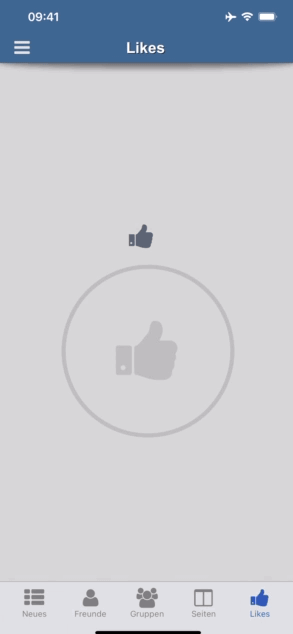

# Titanium BottomSheetController iOS Module (iOS 15+ and fallback version for older iOS) - UISheetPresentationController




## Methods

### MODULE  -> `createBottomSheet({properties}) `
returns the **bottomSheetObject**

## bottomSheetObject Methods
### `show({animated:bool}) `
### `hide({animated:bool}) ` 
manually hide the controller, per exaple if to did any action in the content view
### `selectedDetentIdentifier`
return STRING - selectedDetentIdentifier (medium,large or none)
### `changeCurrentDetent(STRING)`
change the selectedDetentIdentifier animated ('large' or 'medium') **on 'nonSystemSheet:false' only** (iOS15+)


## Events

### `opened `
### `closed `
### `dismissing `
### `detentChange ` returns {"selectedDetentIdentifier":"medium",....}


## Properties

### `detents:{large:bool,medium:bool,small:bool}`
The object of heights where a sheet can rest.
*if not set, default to 'medium' only*

### `preferredCornerRadius:integer`
The corner radius that the sheet attempts to present with.
*if not set default to iOS default radius*

###	`prefersEdgeAttachedInCompactHeight:bool`
A Boolean value that determines whether the sheet attaches to the bottom edge of the screen in a compact-height size class.

### `prefersScrollingExpandsWhenScrolledToEdge:bool`
A Boolean value that determines whether scrolling expands the sheet to a larger detent.

### `widthFollowsPreferredContentSizeWhenEdgeAttached:bool`
A Boolean value that determines whether the sheet's width matches its view controller's preferred content size.

### `prefersGrabberVisible:bool`
A Boolean value that determines whether the sheet shows a grabber at the top.

### `nonModal:bool`
has effect ONLY when "nonSystemSheet:false" on iOS >= 15


### `largestUndimmedDetentIdentifier:string`
medium or large - if not set, it is full dimmed depending on activated detents - The largest detent that doesn’t dim the view underneath the sheet. 
***If not set, defaults to full dimmed***

### `contentView:TiUIView,TiUIWindow or TiUINavigationWindow`
View (any kind), Window or NavigationWindow

### `closeButton:TiUIView`
View or Button

### `backgroundColor:Hex or String`

### `nonSystemSheet:bool`
A Boolean value that determines whether the sheet is iOS15 or fallback version - if "false" and device is non iOS15 it also fallbacks - **if NOT SET -> defaults to "true"**

### `nonSystemSheetTopShadow:bool`
topShadow visible or not visible

### `nonSystemSheetShouldScroll:bool`
when your contentView is not a scrollable view, then this activates scrolling if the contentView is larger then the bottomSheet

**ATTENTION**: when you put a tableView, scrollView or listView inside your contentView this property disables scrolling in the contentView in favour of the bottomSheetScrollView


### `nonSystemSheetAutomaticStartPositionFromContentViewHeight:bool`
when this property is "**true**" the nonSystemSheet opens in the height of the contentView, **all detents are disabled**,

only the real height is active, 

"**startDetent**" property **will be ignored**, also the "detents" property are ignored -- 

if you want an undimmed background, then you need to set property "**largestUndimmedDetentIdentifier**" to "large"

if NOT set defaults to false

### `nonSystemSheetSmallHeight:integer`
(optional) when set, the small detent is set to this height

### `nonSystemSheetMediumHeight:integer`
(optional) when set, the medium detent is set to this height

### `nonSystemSheetLargeHeight:integer`
(optional) when set, the large detent is set to this height


## Example

```js

var TiBottomSheetControllerModule = require("ti.bottomsheetcontroller");


var tableRows = [];

var tableData = [ {title: 'Apples'}, {title: 'Bananas'}, {title: 'Carrots'}, {title: 'Potatoes'},{title: 'Apples'}, {title: 'Bananas'}, {title: 'Carrots'}, {title: 'Potatoes'},{title: 'Apples'}, {title: 'Bananas'}, {title: 'Carrots'}, {title: 'Potatoes'},{title: 'Apples'}, {title: 'Bananas'}, {title: 'Carrots'}, {title: 'Potatoes'},{title: 'Apples'}, {title: 'Bananas'}, {title: 'Carrots'}, {title: 'Potatoes'},{title: 'Apples'}, {title: 'Bananas'}, {title: 'Carrots'}, {title: 'Potatoes'},{title: 'Apples'}, {title: 'Bananas'}, {title: 'Carrots'}, {title: 'Potatoes'} ];

for (var j = 0; j < tableData.length; j++) {
			var rowView = Ti.UI.createView({
				top:1,
				bottom:1,
				width:Ti.UI.FILL,
				height:62,
				backgroundColor:'transparent'
			});

			var title = Ti.UI.createLabel({
				color: '#000',
				width:Ti.UI.SIZE,
				height:Ti.UI.SIZE,
				font: {
					fontFamily : 'Arial',
					fontSize: 22,
					fontWeight: 'bold'
				},
				text: tableData[j].title
			});
			rowView.add(title);

			var row = Ti.UI.createTableViewRow({
				className:'test', 
				height:60,
				backgroundColor:'transparent',
				width:Ti.UI.FILL
			});
			row.add(rowView);
			tableRows.push(row);
}


var bottomView = Ti.UI.createTableView({
	top:0,
	left:0,
	right:0,
	bottom:0,
	showVerticalScrollIndicator: true,
	width:Ti.UI.FILL,
	height:500,
	contentHeight:Ti.UI.SIZE,
	minRowHeight:60,
	scrollable: true,
	scrollType:'vertical',
	backgroundColor:'transparent'
});

bottomView.setData(tableRows,{animated:false});


var bottomSheetController = TiBottomSheetControllerModule.createBottomSheet({
	detents:{large:true,medium:true,small:false}, // "small" has effect only when "nonSystemSheet:true"
	startDetent:'medium', // medium or large -  when "nonSystemSheet:true" also "small" is possible -- when startDetent is "small" and detents:{small:false} is defaults to "medium" and so on...
	preferredCornerRadius:20,
	prefersEdgeAttachedInCompactHeight:false, // has effect only when "nonSystemSheet:false"
	prefersScrollingExpandsWhenScrolledToEdge:false, // has effect only when "nonSystemSheet:false"
				widthFollowsPreferredContentSizeWhenEdgeAttached:true, // has effect only when "nonSystemSheet:false"
	prefersGrabberVisible:true, // bottomSheet grabberHandle visible true / false
	nonModal:false, // has effect ONLY when "nonSystemSheet:false" on iOS >= 15
	largestUndimmedDetentIdentifier:'small', // medium or large (also "small" available when "nonSystemSheet:true") - if not set, it is full dimmed depending on activated detents when "nonSystemSheet:true" the property also allow to interact with the view in the background of the bottomSheet - when not dimmed, when dimmed interaction is not possible with the view in the background
	contentView: bottomView,
	closeButton:YOUR_CLOSEBUTTON_VIEW_FOR_THE_SHEET, // add a closeButtonView to the bottomSheet
	backgroundColor:'#eeeeee', 

	nonSystemSheet:false, // defaults to "true" if not set - non iOS 15 SheetController (backwards compatible to non iOS15) when "true" - iOS15+ SheetController when "false" - if non iOS15 and set to "false" it also defaults to "true"
	nonSystemSheetTopShadow:true, // has effect only on "nonSystemSheet:true"
	nonSystemSheetShouldScroll:true, // when your contentView is not a scrollable view, then this activates scrolling if the contentView is larger then the bottomSheet 
				// ATTENTION: when you put a tableView, scrollView or listView inside your contentView this property disables scrolling in the contentView in favour of the bottomSheetScrollView
});

bottomSheetController.addEventListener('dismissing', function() {
	console.log("bottomSheet dismissing");
});

bottomSheetController.addEventListener('closed', function() {
	console.log("bottomSheet closed");
});

bottomSheetController.addEventListener('opened', function() {
	console.log("bottomSheet opened");
});
bottomSheetController.addEventListener('detentChange', function(e) {
	console.log("\n\n bottomSheet detentChange: "+JSON.stringify(e)+"\n\n");

	console.log("returns the at any time you call the propery -> bottomSheetController.selectedDetentIdentifier: "+bottomSheetController.selectedDetentIdentifier);
});

bottomSheetController.show({ 
	animated:true
});

```

## License

MIT

## Author

Marc Bender
