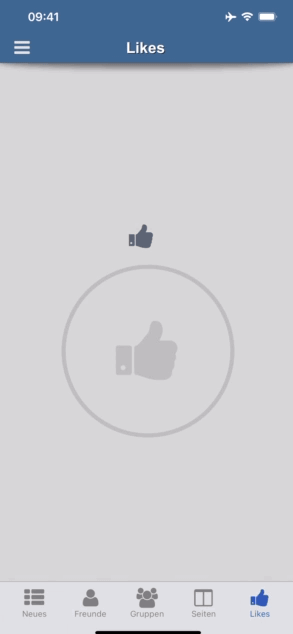
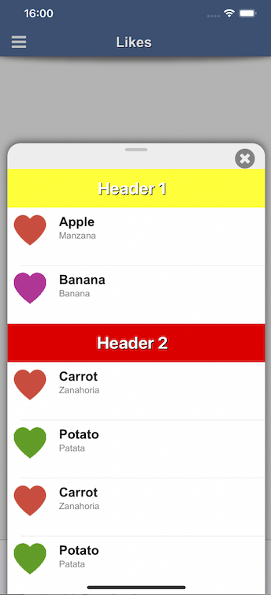

# Titanium Mobile SDK BottomSheetController iOS Module
(https://titaniumsdk.com/)

Created by **Marc Bender** | Version 1.3.0 | iOS 15+ & Mac Catalyst compatible

A powerful Titanium Mobile iOS module for bottom sheets on iOS with two implementation modes:
- **System Sheet** (native iOS 15+ `UISheetPresentationController`)
- **Custom Sheet** (custom implementation for maximum control and backwards compatibility)




---

## Table of Contents

- [Installation](#installation)
- [Quick Start](#quick-start)
- [Modes: System Sheet vs. Custom Sheet](#modes-system-sheet-vs-custom-sheet)
- [Properties](#properties)
  - [General Properties](#general-properties)
  - [System Sheet Properties (nonSystemSheet:false)](#system-sheet-properties-nonsystemsheetfalse)
  - [Custom Sheet Properties (nonSystemSheet:true)](#custom-sheet-properties-nonsystemsheettrue)
- [Methods](#methods)
- [Events](#events)
- [Examples](#examples)
  - [Simple Bottom Sheet](#simple-bottom-sheet)
  - [Custom Detents (iOS 16+)](#custom-detents-ios-16)
  - [Bottom Sheet with TableView](#bottom-sheet-with-tableview)
  - [System Sheet with Pan Gesture Disabled](#system-sheet-with-pan-gesture-disabled)
- [FAQ](#faq)
- [Changelog](#changelog)
- [License](#license)

---

## Installation

```bash
# Download the ZIP file and copy it to your Titanium project
# ios/ directory of your project:
cp ti.bottomsheetcontroller-iphone-1.3.0.zip your-project/app/assets/iphone/modules/ti.bottomsheetcontroller.zip
```

**Requirements:**
- Titanium SDK 13.2.0+
- iOS 15+ (for System Sheet features)
- Mac Catalyst 15+ compatible

---

## Quick Start

```javascript
var TiBottomSheetControllerModule = require("ti.bottomsheetcontroller");

// Create content view
var contentView = Ti.UI.createView({
    backgroundColor: '#ffffff',
    layout: 'vertical'
});

contentView.add(Ti.UI.createLabel({
    text: 'Hello Bottom Sheet!',
    font: { fontSize: 20, fontWeight: 'bold' },
    top: 60,
    left: 20,
    right: 20,
    textAlign: 'center'
}));

// Create bottom sheet
var bottomSheet = TiBottomSheetControllerModule.createBottomSheet({
    contentView: contentView,
    detents: { large: true, medium: true, small: true },
    startDetent: 'medium',
    prefersGrabberVisible: true,
    nonSystemSheet: false  // native iOS 15+ sheet
});

// Event listeners
bottomSheet.addEventListener('open', function() {
    Ti.API.info('Bottom sheet opened');
});

bottomSheet.addEventListener('close', function() {
    Ti.API.info('Bottom sheet closed');
});

// Open/Close
bottomSheet.open({ animated: true });
// bottomSheet.close({ animated: true });
```

---

## Modes: System Sheet vs. Custom Sheet

| Feature | System Sheet (`nonSystemSheet:false`) | Custom Sheet (`nonSystemSheet:true`, Default) |
|---------|---------------------------------------|-----------------------------------------------|
| iOS Version | 15+ (automatic fallback to Custom) | All iOS versions |
| Animation | Native iOS animation | Custom animation |
| Detents | `large`, `medium`, custom (iOS 16+) | `large`, `medium`, `small` + custom heights |
| Performance | Excellent (native) | Good |
| Customizability | Standard iOS behavior | Maximum control over appearance |
| Pan-to-dismiss | ✅ | ✅ (disableable) |
| Touch-to-dismiss | ✅ | ✅ (disableable) |

**Recommendation:**
- Use **System Sheet** for native iOS 15+ feel
- Use **Custom Sheet** for maximum control, custom heights, or older iOS versions

---

## Properties

### General Properties

| Property | Type | Default | Description |
|----------|------|---------|-------------|
| `contentView` | `TiUIView`, `TiUIWindow`, `TiUINavigationWindow` | *required* | The view/window displayed in the bottom sheet |
| `closeButton` | `TiUIView` | `null` | Optional close button (positioned top-right) |
| `backgroundColor` | `Hex` or `String` | `#eeeeee` | Background color of the bottom sheet |
| `width` | `INTEGER` (DIP) | Screen Width | Width of the bottom sheet (Custom Sheet only) |
| `preferredCornerRadius` | `INTEGER` | iOS Default | Corner radius in points |
| `prefersGrabberVisible` | `BOOL` | `true` | Shows the grabber handle at the top of the sheet |

#### `contentView`

The main content view. Can be:
- `Ti.UI.createView()` - simple view
- `Ti.UI.createWindow()` - window with its own lifecycle
- `Ti.UI.createNavigationWindow()` - navigation window with back button support

```javascript
// Example with NavigationWindow
var navWindow = Ti.UI.createNavigationWindow();
var win = Ti.UI.createWindow({ backgroundColor: 'white' });
navWindow.open(win);

var bottomSheet = TiBottomSheetControllerModule.createBottomSheet({
    contentView: navWindow,
    // ...
});
```

#### `closeButton`

Optional button for closing. Automatically positioned top-right:

```javascript
var closeButton = Ti.UI.createButton({
    title: '✕',
    width: 30,
    height: 30,
    font: { fontSize: 16 }
});

closeButton.addEventListener('click', function() {
    bottomSheet.close({ animated: true });
});
```

---

### System Sheet Properties (`nonSystemSheet:false`)

| Property | Type | Default | Description |
|----------|------|---------|-------------|
| `nonSystemSheet` | `BOOL` | `true` | Set to `false` for native iOS 15+ sheet |
| `detents` | `Object` | `{ medium: true }` | Available detent sizes |
| `customDetents` | `Object` | `null` | Custom detents (iOS 16+) |
| `startDetent` | `String` | Auto | Starting detent: `'large'`, `'medium'`, or custom key |
| `largestUndimmedDetentIdentifier` | `String` | `'large'` | Largest detent without background dimming |
| `nonModal` | `BOOL` | `false` | Modal behavior |
| `prefersEdgeAttachedInCompactHeight` | `BOOL` | `false` | Attach to bottom edge in compact mode |
| `prefersScrollingExpandsWhenScrolledToEdge` | `BOOL` | `false` | Scrolling expands to next detent |
| `widthFollowsPreferredContentSizeWhenEdgeAttached` | `BOOL` | `false` | Width follows content size |
| `systemSheetDisablePanGestureDismiss` | `BOOL` | `false` | Disable pan gesture (drag down to close) |

#### `detents`

Defines which detent sizes are available:

```javascript
detents: {
    large: true,   // Full screen (approx. 85% screen height)
    medium: true,  // Middle (approx. 50% screen height)
    small: false   // Not available in System Sheet
}
```

#### `customDetents` (iOS 16+)

Custom detent sizes with user-defined keys:

```javascript
customDetents: {
    customA: 100,  // Key: 'customA', Height: 100 points
    customB: 200,  // Key: 'customB', Height: 200 points
    customC: 300   // Key: 'customC', Height: 300 points
}
```

**Important:** The key is returned in the `detentChange` event:
```javascript
bottomSheet.addEventListener('detentChange', function(e) {
    // e.selectedDetentIdentifier = 'customA' | 'customB' | 'customC'
});
```

#### `startDetent`

Determines the initial detent when opening:

```javascript
// Standard detents
startDetent: 'medium'  // or 'large'

// Custom detents (iOS 16+)
startDetent: 'customA' // Uses the key from customDetents
```

#### `largestUndimmedDetentIdentifier`

Controls background dimming. Everything below the specified detent has no dark background:

```javascript
// Background is not dimmed at medium detent
largestUndimmedDetentIdentifier: 'medium'

// For custom detents
largestUndimmedDetentIdentifier: 'customB'
```

---

### Custom Sheet Properties (`nonSystemSheet:true`)

| Property | Type | Default | Description |
|----------|------|---------|-------------|
| `nonSystemSheet` | `BOOL` | `true` | Set to `true` (or omit) for custom sheet |
| `detents` | `Object` | `{ medium: true }` | Available detent sizes |
| `startDetent` | `String` | `'small'` | Starting detent: `'large'`, `'medium'`, `'small'` |
| `largestUndimmedDetentIdentifier` | `String` | `'small'` | Largest detent without dimming |
| `nonSystemSheetSmallHeight` | `INTEGER` | 130 | Height of small detent in points |
| `nonSystemSheetMediumHeight` | `INTEGER` | Screen/2 | Height of medium detent |
| `nonSystemSheetLargeHeight` | `INTEGER` | Screen-100 | Height of large detent |
| `nonSystemSheetTopShadow` | `BOOL` | `false` | Show shadow on top |
| `nonSystemSheetHandleColor` | `Hex` or `String` | Auto (dark/light) | Color of the grabber handle |
| `nonSystemSheetShouldScroll` | `BOOL` | `false` | Enable scrolling if content is too large |
| `nonSystemSheetAutomaticStartPositionFromContentViewHeight` | `BOOL` | `false` | Start height based on content |
| `nonSystemSheetDisableDimmedBackground` | `BOOL` | `false` | Disable background dimming |
| `nonSystemSheetDisableDimmedBackgroundTouchDismiss` | `BOOL` | `false` | Disable touch-to-dismiss |
| `nonSystemSheetDisablePanGestureDismiss` | `BOOL` | `false` | Disable pan gesture (drag down to close) |

#### Custom Heights

Full control over detent sizes:

```javascript
nonSystemSheetSmallHeight: 200,   // Small detent: 200 points high
nonSystemSheetMediumHeight: 400,  // Medium detent: 400 points high
nonSystemSheetLargeHeight: 700    // Large detent: 700 points high
```

#### `nonSystemSheetShouldScroll`

If content is larger than the sheet, automatic scrolling can be enabled:

```javascript
nonSystemSheetShouldScroll: true
```

**Note:** If the contentView already contains a TableView/ScrollView, scrolling of inner views will be disabled in favor of the sheet scrolling!

#### `nonSystemSheetAutomaticStartPositionFromContentViewHeight`

The sheet opens at the exact height of the content (all detents are ignored):

```javascript
nonSystemSheetAutomaticStartPositionFromContentViewHeight: true,
largestUndimmedDetentIdentifier: 'large' // For non-dimmed background
```

#### Disabling Pan & Touch Gestures

```javascript
// Disable drag down to close
nonSystemSheetDisablePanGestureDismiss: true,

// Disable touch on background to close
nonSystemSheetDisableDimmedBackgroundTouchDismiss: true,

// Disable complete dimming
nonSystemSheetDisableDimmedBackground: true
```

---

## Methods

### `createBottomSheet(properties)`

Creates a new bottom sheet object.

**Parameter:** `properties` - Object with all properties described above

**Returns:** BottomSheetController object

```javascript
var bottomSheet = TiBottomSheetControllerModule.createBottomSheet({
    contentView: myView,
    detents: { large: true, medium: true },
    startDetent: 'medium'
});
```

---

### `open({ animated })`

Opens the bottom sheet.

**Parameter:**
- `animated` (BOOL, default: `true`) - Show animation

```javascript
bottomSheet.open({ animated: true });
```

**Note:** Calling `open()` multiple times while the sheet is already open will be ignored (with console warning).

---

### `close({ animated })`

Closes the bottom sheet.

**Parameter:**
- `animated` (BOOL, default: `true`) - Show animation

```javascript
bottomSheet.close({ animated: true });
```

**Note:** Useful for programmatic closing after an action in the sheet.

---

### `selectedDetentIdentifier` (Property)

Returns the current detent as a string.

**Returns:** `String` - `'large'`, `'medium'`, `'small'`, or custom key

```javascript
var currentDetent = bottomSheet.selectedDetentIdentifier;
Ti.API.info('Current detent: ' + currentDetent);
```

---

### `changeCurrentDetent(identifier)`

Animates to a different detent. **System Sheet only (`nonSystemSheet:false`)**!

**Parameter:**
- `identifier` (String) - `'large'`, `'medium'`, or custom key from `customDetents`

```javascript
// Switch to medium
bottomSheet.changeCurrentDetent('medium');

// Switch to custom detent (iOS 16+)
bottomSheet.changeCurrentDetent('customB');
```

---

## Events

### `open`

Fired when the bottom sheet has fully opened.

```javascript
bottomSheet.addEventListener('open', function(e) {
    Ti.API.info('Bottom sheet was opened');
});
```

---

### `close`

Fired when the bottom sheet has fully closed.

```javascript
bottomSheet.addEventListener('close', function(e) {
    Ti.API.info('Bottom sheet was closed');
    // Clean up resources, reset state, etc.
});
```

---

### `dismissing`

Fired when the bottom sheet starts to close (before animation).

```javascript
bottomSheet.addEventListener('dismissing', function(e) {
    Ti.API.info('Bottom sheet is closing...');
    // You can prevent closing by calling close() here
});
```

---

### `detentChange`

Fired when the detent changes (via user interaction or `changeCurrentDetent()`).

**Event Object:**
- `selectedDetentIdentifier` (String) - The new detent identifier

```javascript
bottomSheet.addEventListener('detentChange', function(e) {
    Ti.API.info('Detent changed to: ' + e.selectedDetentIdentifier);
    
    // Can be used to dynamically adjust content
    if (e.selectedDetentIdentifier === 'large') {
        // Show extended content options
    } else if (e.selectedDetentIdentifier === 'medium') {
        // Show standard content
    }
});
```

---

## Examples

### Simple Bottom Sheet

```javascript
var TiBottomSheetControllerModule = require("ti.bottomsheetcontroller");

var win = Ti.UI.createWindow({ backgroundColor: 'white' });

// Content view
var contentView = Ti.UI.createView({
    backgroundColor: '#ffffff',
    layout: 'vertical'
});

contentView.add(Ti.UI.createLabel({
    text: 'Bottom Sheet Content',
    font: { fontSize: 20, fontWeight: 'bold' },
    top: 60,
    left: 20,
    right: 20,
    textAlign: 'center'
}));

contentView.add(Ti.UI.createButton({
    title: 'Close Bottom Sheet',
    top: 100,
    left: 20,
    right: 20,
    height: 44
}));

// Close button
var closeButton = Ti.UI.createButton({
    title: '✕',
    width: 30,
    height: 30,
    font: { fontSize: 16 }
});

// Create bottom sheet
var bottomSheet = TiBottomSheetControllerModule.createBottomSheet({
    contentView: contentView,
    closeButton: closeButton,
    backgroundColor: '#ffffff',
    detents: { large: true, medium: true, small: true },
    startDetent: 'medium',
    prefersGrabberVisible: true,
    nonSystemSheet: true,  // Custom Sheet
    preferredCornerRadius: 14
});

// Event listeners
contentView.children[1].addEventListener('click', function() {
    bottomSheet.close({ animated: true });
});

closeButton.addEventListener('click', function() {
    bottomSheet.close({ animated: true });
});

bottomSheet.addEventListener('open', function() {
    Ti.API.info('Bottom sheet opened');
});

bottomSheet.addEventListener('close', function() {
    Ti.API.info('Bottom sheet closed');
});

// Open button
var openButton = Ti.UI.createButton({
    title: 'Open Bottom Sheet',
    top: 50,
    left: 20,
    right: 20,
    height: 44
});

openButton.addEventListener('click', function() {
    bottomSheet.open({ animated: true });
});

win.add(openButton);
win.open();
```

---

### Custom Detents (iOS 16+)

```javascript
var bottomSheet = TiBottomSheetControllerModule.createBottomSheet({
    contentView: myContentView,
    nonSystemSheet: false,  // System Sheet
    
    // Disable standard detents
    detents: {
        large: false,
        medium: false,
        small: false
    },
    
    // Define custom detents
    customDetents: {
        compact: 120,     // 120 points high
        standard: 250,    // 250 points high
        expanded: 400     // 400 points high
    },
    
    startDetent: 'standard',
    prefersGrabberVisible: true,
    preferredCornerRadius: 16
});

bottomSheet.addEventListener('detentChange', function(e) {
    Ti.API.info('Detent: ' + e.selectedDetentIdentifier);
    // 'compact', 'standard', or 'expanded'
    
    // Dynamically switch to another detent
    if (e.selectedDetentIdentifier === 'compact') {
        setTimeout(function() {
            bottomSheet.changeCurrentDetent('expanded');
        }, 1000);
    }
});
```

---

### Bottom Sheet with TableView

```javascript
var TiBottomSheetControllerModule = require("ti.bottomsheetcontroller");

// Create table data
var tableData = [];
for (var i = 1; i <= 50; i++) {
    tableData.push({ title: 'Item ' + i });
}

// Create TableView
var tableView = Ti.UI.createTableView({
    top: 0,
    left: 0,
    right: 0,
    bottom: 0,
    backgroundColor: 'transparent',
    minRowHeight: 50
});

tableView.setData(tableData);

// Row click handler
tableView.addEventListener('click', function(e) {
    Ti.API.info('Clicked: ' + e.row.title);
    // Optional: close sheet after click
    // bottomSheet.close({ animated: true });
});

// Create bottom sheet
var bottomSheet = TiBottomSheetControllerModule.createBottomSheet({
    contentView: tableView,
    detents: { large: true, medium: true, small: true },
    startDetent: 'medium',
    nonSystemSheet: true,
    preferredCornerRadius: 12,
    nonSystemSheetTopShadow: true
});

// Open button
var openButton = Ti.UI.createButton({
    title: 'Open List Sheet',
    top: 50,
    left: 20,
    right: 20,
    height: 44
});

openButton.addEventListener('click', function() {
    bottomSheet.open({ animated: true });
});

Ti.UI.currentWindow.add(openButton);
```

---

### System Sheet with Pan Gesture Disabled

```javascript
var bottomSheet = TiBottomSheetControllerModule.createBottomSheet({
    contentView: myContentView,
    nonSystemSheet: false,  // System Sheet
    
    detents: { large: true, medium: true },
    startDetent: 'medium',
    
    // Disable pan gesture to close
    systemSheetDisablePanGestureDismiss: true,
    
    // Only closable via close button or .close()
    closeButton: myCloseButton
});

myCloseButton.addEventListener('click', function() {
    bottomSheet.close({ animated: true });
});

// Or programmatically
setTimeout(function() {
    bottomSheet.close({ animated: true });
}, 5000); // Auto-closes after 5 seconds
```

---

## FAQ

### Which mode should I use?

- **System Sheet** (`nonSystemSheet: false`): For native iOS 15+ feel, best performance, fewer customization options
- **Custom Sheet** (`nonSystemSheet: true`): For maximum control, custom heights, older iOS versions

### Why doesn't `changeCurrentDetent()` work in Custom Sheet?

This method is only available for System Sheet. In Custom Sheet, you can change detents by tapping the grabber handle or using `open()`/`close()`.

### How do I disable closing by dragging?

```javascript
// Custom Sheet
nonSystemSheetDisablePanGestureDismiss: true,

// System Sheet
systemSheetDisablePanGestureDismiss: true
```

### Why isn't my TableView scrolling?

If `nonSystemSheetShouldScroll: true` is set, scrolling of inner views is disabled. Set it to `false` if your content is already scrollable.

### Can I open/close the sheet multiple times?

Yes! After closing (`close()`), the sheet can be opened again with `open()`. The internal state is properly reset.

---

## Changelog

### v1.3.0
- `systemSheetDisablePanGestureDismiss` property for System Sheet
- Improved event handling logic (no duplicate events)
- Code optimizations and bug fixes

### v1.2.0
- Custom detents support (iOS 16+)
- `customDetents` property with user-defined keys
- `changeCurrentDetent()` method for System Sheet

### v1.1.0
- Mac Catalyst support (15+)
- Improved safe area handling
- Rotation bug fixes

### v1.0.7
- Mac Catalyst compatible

### v1.0.5 / v1.0.6
- Events and methods refactored
- New features for Custom Sheet
- `nonSystemSheetAutomaticStartPositionFromContentViewHeight`
- Various bug fixes

---

## License

MIT License

Copyright (c) 2021-2024 Marc Bender

Permission is hereby granted, free of charge, to any person obtaining a copy of this software and associated documentation files (the "Software"), to deal in the Software without restriction, including without limitation the rights to use, copy, modify, merge, publish, distribute, sublicense, and/or sell copies of the Software, and to permit persons to whom the Software is furnished to do so, subject to the following conditions:

The above copyright notice and this permission notice shall be included in all copies or substantial portions of the Software.

THE SOFTWARE IS PROVIDED "AS IS", WITHOUT WARRANTY OF ANY KIND, EXPRESS OR IMPLIED, INCLUDING BUT NOT LIMITED TO THE WARRANTIES OF MERCHANTABILITY, FITNESS FOR A PARTICULAR PURPOSE AND NONINFRINGEMENT. IN NO EVENT SHALL THE AUTHORS OR COPYRIGHT HOLDERS BE LIABLE FOR ANY CLAIM, DAMAGES OR OTHER LIABILITY, WHETHER IN AN ACTION OF CONTRACT, TORT OR OTHERWISE, ARISING FROM, OUT OF OR IN CONNECTION WITH THE SOFTWARE OR THE USE OR OTHER DEALINGS IN THE SOFTWARE.

---

## Author

**Marc Bender**
- Titanium Module Developer
- iOS & Mobile Development
